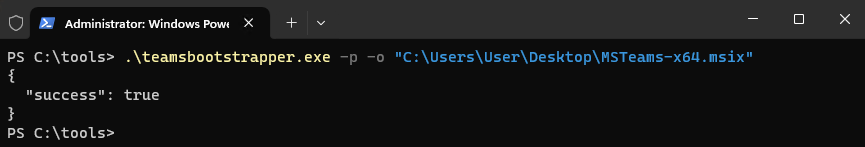

# <center>[Скачивание и установка New Teams с помощью автономного установщика](https://learn.microsoft.com/en-us/microsoftteams/new-teams-bulk-install-client)  </center>

## Вариант 1.  
1.	Скачайте MSIX:  
    * [MSIX x86](https://go.microsoft.com/fwlink/?linkid=2196060&clcid=0x409)  
    * [MSIX x64](https://go.microsoft.com/fwlink/?linkid=2196106)  
    * [ARM64](https://go.microsoft.com/fwlink/?linkid=2196207&clcid=0x409)  
2.	Откройте командную строку  

    Для локального пути введите:  
    ```PowerShell
    Add-AppxPackage -path " c:\MS_Teams\MSTeams-x64.msix"
    ```


## Вариант 2.  
1.	[Скачайте установщик .exe](https://go.microsoft.com/fwlink/?linkid=2243204&clcid=0x409). Если вы скачали этот файл ранее, убедитесь, что у вас установлена последняя версия, сравнив свойства каждого файла.  
2.	Скачайте MSIX:  
    - [MSIX x86](https://go.microsoft.com/fwlink/?linkid=2196060&clcid=0x409)  
    - [MSIX x64](https://go.microsoft.com/fwlink/?linkid=2196106)  
    - [ARM64](https://go.microsoft.com/fwlink/?linkid=2196207&clcid=0x409)  
3.	Откройте командную строку **как Администратор** и перейдите в директорию с установщиком «teamsbootstrapper.exe».  

Для локального пути введите:  
```PowerShell
.\teamsbootstrapper.exe -p -o " c:\apps\MS_Teams\MSTeams-x64.msix"
```

Пример:  
